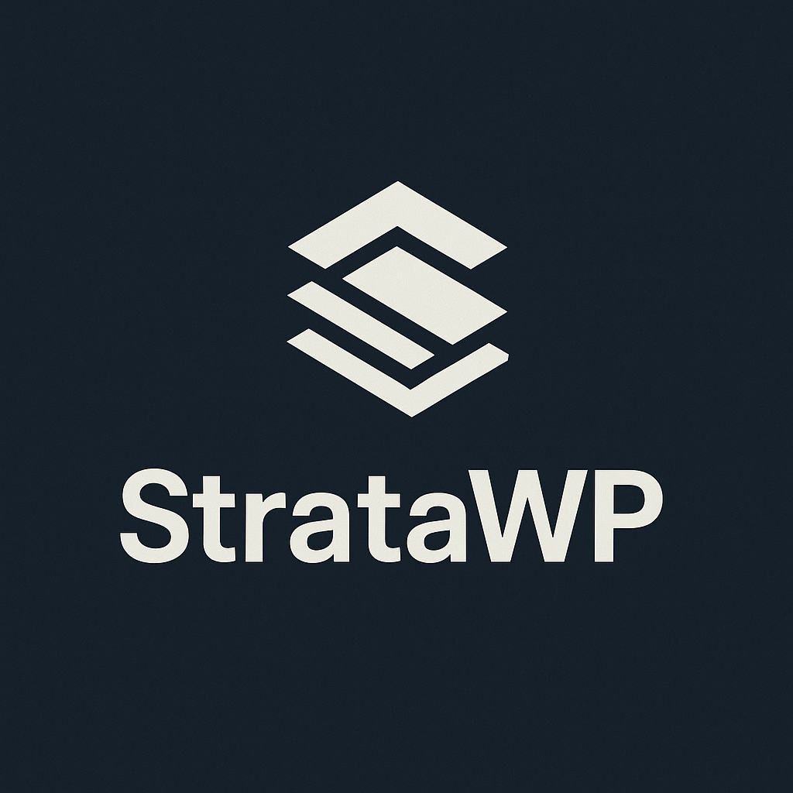

<div align="center">
  

  # StrataWP

  **A modern, powerful WordPress theme framework**
</div>

<div align="center">

[](https://www.gnu.org/licenses/gpl-3.0)
[](https://www.typescriptlang.org/)
[](https://www.php.net/)
[](https://www.npmjs.com/package/@stratawp/cli)
[](https://www.npmjs.com/package/@stratawp/vite-plugin)

</div>

---

StrataWP is a next-generation WordPress theme framework that takes modern development practices to the next level. Built from the ground up with TypeScript, Vite, and cutting-edge tooling, it's designed to make WordPress theme development fast, type-safe, and enjoyable.

## What's New in v0.4.0

**AI-Assisted Development is Here!**

This release introduces comprehensive AI integration to accelerate your WordPress theme development:

### AI-Powered Development Tools
- **Code Generation**: Generate Gutenberg blocks, theme components, and block patterns from natural language descriptions
- **Code Review**: AI-powered analysis for security vulnerabilities, performance issues, and best practices
- **Documentation**: Automatically create comprehensive Markdown, PHPDoc, or JSDoc documentation
- **Multi-Provider Support**: Choose between OpenAI GPT-4 or Anthropic Claude 3.5 Sonnet
- **Flexible Configuration**: Configure via `.env` files or centralized config

**New Commands:**
```bash
stratawp ai:setup        # Interactive AI provider configuration
stratawp ai:generate     # Generate blocks, components, patterns
stratawp ai:review       # Security, performance, best practices review
stratawp ai:document     # Generate comprehensive documentation
```

## What's New in v0.3.0

**Three Complete Production-Ready Themes!**

This release adds two new fully-featured example themes showcasing advanced WordPress development:

### Advanced Theme - Enterprise Features
- **4 Custom Post Types**: Portfolio (with categories/tags), Team Members (with departments), Testimonials (with ratings), Case Studies (with industries/services)
- **Custom Gutenberg Blocks**: Portfolio Grid and Team Members blocks with full editor controls
- **Advanced Layouts Component**: Customizer integration, container width control, layout management
- **Meta Boxes System**: Comprehensive custom fields for all post types with proper security
- **5 Integrated Components**: Full component architecture demonstration

### Store Theme - WooCommerce E-Commerce
- **4 WooCommerce Templates**: Shop, Product, Cart, and Checkout pages optimized for FSE
- **2 Product Blocks**: Featured Products and Product Categories with full customization
- **4 E-Commerce Patterns**: Product showcases, category grids, hero sections, sale banners
- **WooCommerce Integration**: Enhanced product displays, cart notifications, checkout customization
- **Complete Store Styling**: Professional e-commerce CSS with hover effects and mobile optimization

### v0.2.0 Features

- **CLI Scaffolding** - Generate templates, parts, components, and blocks with commands
- **Design System Integration** - Full Tailwind CSS and UnoCSS support with WordPress preset mappings
- **Performance Optimization** - Automatic critical CSS extraction, lazy loading, and asset preloading
- **Enhanced Block Generation** - Blocks now support style framework integration

### v0.1.0 (Initial Release)

- **Published npm packages** - `@stratawp/cli` and `@stratawp/vite-plugin` are live
- **Block Theme (FSE) support** - Full Site Editing out of the box
- **Vite integration** - Lightning-fast HMR and build times
- **TypeScript-first** - Type safety across your entire theme
- **Block auto-registration** - Automatic WordPress block registration
- **PHP Hot Module Replacement** - See PHP changes instantly

## Quick Start

### Create a New Theme

```bash
# Create a new StrataWP theme (easiest way!)
npx create-stratawp my-theme

# Navigate to your theme
cd my-theme

# Start developing with hot reload
npm run dev
```

### Or Clone and Explore

```bash
# Clone the repository (OUTSIDE your WordPress themes directory)
git clone https://github.com/JonImmsWordpressDev/StrataWP.git
cd StrataWP

# Install dependencies
pnpm install

# Create a symlink to use the basic theme in WordPress
# Replace /path/to/wordpress with your WordPress installation path
ln -s "$(pwd)/examples/basic-theme" /path/to/wordpress/wp-content/themes/stratawp-basic

# Start the dev server
cd examples/basic-theme
pnpm dev

# Build for production
pnpm build
```

**Recommended Setup:**
- Clone the repository outside `wp-content/themes/`
- Create a symlink from the theme to your WordPress installation
- This keeps your development files separate from WordPress

## Why StrataWP?

While inspired by excellent frameworks like WPRig, StrataWP goes further with modern tooling and developer experience.

### Available Now

- **TypeScript-First**: Full type safety across PHP and JavaScript
- **Vite-Powered**: Lightning-fast HMR and build times (sub-second rebuilds)
- **Block Theme (FSE)**: Full Site Editing support out of the box
- **Block Auto-Registration**: Automatically discovers and registers Gutenberg blocks
- **PHP Hot Reload**: See PHP template changes without page refresh
- **Modern Tooling**: Monorepo with Turborepo and pnpm
- **WordPress Manifest**: Automatic asset manifest generation for WordPress
- **Three Example Themes**: Learn from complete, production-ready themes
- **Sitecore-Inspired Design**: Beautiful, professional design system included
- **CLI Scaffolding**: Generate templates, parts, components, and blocks with intuitive commands
- **Design System Integration**: Choose Tailwind CSS or UnoCSS with WordPress preset mappings
- **Performance Optimization**: Automatic critical CSS extraction, lazy loading, and preloading
- **AI-Assisted Development**: OpenAI GPT-4 and Anthropic Claude integration for code generation, review, and documentation

### Coming Soon

- **Component Registry**: Share and reuse components across projects
- **Comprehensive Testing**: Unit, integration, E2E, and visual regression tests
- **Headless-Ready**: First-class support for decoupled architectures
- **Component Explorer**: Built-in Storybook-like component browser

## Installation

### Using the CLI (Recommended)

```bash
npx create-stratawp my-theme
```

This creates a new WordPress theme with:
- Vite development server configured
- TypeScript setup complete
- Block Theme (FSE) structure
- Example blocks and components
- Hot Module Replacement ready

### Manual Installation

```bash
# Install the packages
npm install --save-dev @stratawp/vite-plugin
npm install --global @stratawp/cli

# Or with pnpm
pnpm add -D @stratawp/vite-plugin
pnpm add -g @stratawp/cli
```

## Project Structure

```
StrataWP/
├── packages/
│   ├── ai/               # AI-assisted development tools (OpenAI, Anthropic)
│   ├── cli/              # CLI tool (create-stratawp, stratawp commands)
│   ├── core/             # PHP framework core
│   └── vite-plugin/      # Vite integration for WordPress
├── examples/
│   ├── basic-theme/      # General purpose blog/business theme with Frost design system
│   ├── advanced-theme/   # Enterprise theme with Custom Post Types, advanced layouts, meta boxes
│   └── store-theme/      # WooCommerce e-commerce theme with product blocks and patterns
└── docs/                 # Documentation (coming soon)
```

## Example Themes

### Basic Theme - General Purpose
Perfect for blogs, portfolios, and business sites.

**Features:**
- Frost design system with 52+ professional patterns
- Custom typography control with Google Fonts
- 9 templates (home, blog, single, page, archive, search, 404, blank, no-title)
- Light and dark mode pattern variants
- Responsive design with fluid typography

**Best for:** Blogs, portfolios, small business sites, content-focused websites

### Advanced Theme - Enterprise Features
Showcase of advanced WordPress development capabilities.

**Features:**
- 4 Custom Post Types: Portfolio, Team Members, Testimonials, Case Studies
- Custom Gutenberg blocks: Portfolio Grid, Team Members
- Advanced Layouts component with Customizer integration
- Complete Meta Boxes system with custom fields
- Helper methods for complex queries and displays

**Best for:** Corporate sites, agencies, portfolios, membership sites, complex content structures

### Store Theme - E-Commerce
Full-featured WooCommerce theme ready for online stores.

**Features:**
- 4 WooCommerce templates (shop, product, cart, checkout)
- Featured Products & Product Categories blocks
- 4 e-commerce patterns (showcases, hero, banners, categories)
- WooCommerce integration component
- Professional store styling with animations
- Mobile-optimized shopping experience

**Best for:** Online stores, product catalogs, digital downloads, subscription services

## Features in Detail

### CLI Commands

Generate theme components quickly with intuitive commands:

```bash
# Create WordPress templates
stratawp template:new home --type=home
stratawp template:new about --type=page

# Create template parts
stratawp part:new sidebar --type=sidebar --markup=php
stratawp part:new custom-header --type=header

# Create PHP components
stratawp component:new Analytics --type=feature
stratawp component:new WooCommerce --type=integration

# Create blocks with design system support
stratawp block:new hero --styleFramework=tailwind
stratawp block:new card --styleFramework=unocss

# Setup design system integration
stratawp design-system:setup tailwind
stratawp design-system:setup unocss

# AI-assisted development (requires API key)
stratawp ai:setup                                    # Configure AI provider
stratawp ai:generate block                          # Generate blocks from descriptions
stratawp ai:review functions.php -f security        # Review code for security issues
stratawp ai:document src/components/Header.tsx      # Generate documentation
```

### AI-Assisted Development

StrataWP includes powerful AI tools to accelerate your development workflow. Supports both OpenAI GPT-4 and Anthropic Claude.

#### Setup

Configure your AI provider with the interactive setup wizard:

```bash
stratawp ai:setup
```

Or use environment variables in your `.env` file:

```env
STRATAWP_AI_PROVIDER=anthropic        # or 'openai'
STRATAWP_AI_API_KEY=your-api-key-here
STRATAWP_AI_MODEL=claude-3-5-sonnet-20241022  # optional
```

#### Generate Code with AI

Create Gutenberg blocks, theme components, and block patterns from natural language descriptions:

```bash
# Generate a Gutenberg block
stratawp ai:generate block
# > Describe the block: A hero section with heading, subheading, and CTA button
# > Block name: hero-section
# ✓ Generated block.json, index.tsx, and save.tsx

# Generate a PHP component
stratawp ai:generate component
# > Describe the component: Custom post type manager for portfolio items
# > Component name: PortfolioManager

# Generate a block pattern
stratawp ai:generate pattern
# > Describe the pattern: Three-column feature showcase with icons
# > Pattern name: features-showcase
```

#### Code Review

Get AI-powered code reviews for security, performance, and best practices:

```bash
# Review for all aspects
stratawp ai:review inc/Components/UserAuth.php

# Focus on specific areas
stratawp ai:review functions.php --focus security
stratawp ai:review src/blocks/shop/index.tsx --focus performance
stratawp ai:review inc/Components/API.php --focus best-practices
```

The AI will analyze your code for:
- **Security**: XSS, SQL injection, CSRF, input sanitization, capability checks
- **Performance**: Database queries, caching opportunities, asset loading
- **Best Practices**: WordPress coding standards, modern PHP/JS patterns

#### Generate Documentation

Automatically create comprehensive documentation from your code:

```bash
# Generate documentation (format auto-detected from file extension)
stratawp ai:document inc/Components/Menus.php

# Specify output file
stratawp ai:document src/blocks/team/index.tsx -o docs/team-block.md

# Specify format explicitly
stratawp ai:document inc/Components/CustomPostTypes.php --format phpdoc
```

Supported formats:
- **Markdown**: Comprehensive documentation with sections
- **PHPDoc**: WordPress-compatible PHP documentation
- **JSDoc**: TypeScript/JavaScript documentation

**AI Provider Options:**
- **OpenAI GPT-4**: Powerful general-purpose model ([Get API key](https://platform.openai.com/api-keys))
- **Anthropic Claude**: Excellent for code generation ([Get API key](https://console.anthropic.com/))

See the [`@stratawp/ai` package README](./packages/ai/README.md) for complete documentation.

### Vite Integration

StrataWP includes a custom Vite plugin (`@stratawp/vite-plugin`) with comprehensive features:

```typescript
// vite.config.ts
import { defineConfig } from 'vite'
import { strataWP } from '@stratawp/vite-plugin'

export default defineConfig({
  plugins: [
    strataWP({
      // Automatically discover and register blocks
      blocks: {
        dir: 'src/blocks',
        autoRegister: true,
        namespace: 'my-theme',
      },

      // Design System Integration (NEW in v0.2.0)
      designSystem: {
        enabled: true,
        framework: 'tailwind', // or 'unocss'
        wordpressPresets: true,
      },

      // Performance Optimization (NEW in v0.2.0)
      performance: {
        criticalCSS: {
          enabled: true,
          templates: ['index', 'single', 'page'],
        },
        lazyLoading: {
          enabled: true,
          images: 'native',
        },
        preload: {
          enabled: true,
          assets: ['fonts', 'critical-css'],
        },
      },

      // PHP Hot Module Replacement
      phpHmr: {
        enabled: true,
        watch: ['**/*.php', 'theme.json', 'templates/**/*'],
      },

      // WordPress-compatible manifest
      manifest: {
        enabled: true,
        wordpress: true,
      },
    }),
  ],
})
```

### Design System Integration

Use WordPress theme.json values directly in your utility classes:

```tsx
// Tailwind/UnoCSS classes mapped from theme.json
<div className="text-wp-primary bg-wp-background p-wp-md">
  <h1 className="font-wp-sans text-wp-xl">Hello WordPress!</h1>
</div>
```

WordPress CSS variables are automatically mapped:
- Colors: `text-wp-primary`, `bg-wp-secondary`, `border-wp-accent`
- Spacing: `p-wp-md`, `m-wp-lg`, `gap-wp-sm`
- Typography: `font-wp-sans`, `text-wp-lg`
- Layout: `max-w-wp-container`, `max-w-wp-wide`

### Block Theme (FSE) Support

Both example themes are built as Block Themes with Full Site Editing:

- `theme.json` for global styles and settings
- `templates/` directory for block templates
- `parts/` directory for reusable template parts
- Automatic block registration
- Custom block patterns

### TypeScript & Type Safety

Write type-safe JavaScript that compiles to modern ES modules:

```typescript
// Fully typed WordPress APIs
import { registerBlockType } from '@wordpress/blocks'

registerBlockType('my-theme/hero', {
  title: 'Hero Section',
  category: 'design',
  // ... fully typed configuration
})
```

## Development

This is a monorepo managed with [Turborepo](https://turbo.build/) and [pnpm](https://pnpm.io/).

```bash
# Install dependencies
pnpm install

# Run all packages in dev mode with HMR
pnpm dev

# Build all packages for production
pnpm build

# Run tests (coming soon)
pnpm test

# Lint and format
pnpm lint
pnpm format
```

### Working with Example Themes

```bash
# Start the basic theme dev server
cd examples/basic-theme
pnpm dev

# In another terminal, visit your WordPress site
# The theme will automatically connect to the Vite dev server
# and provide Hot Module Replacement
```

## Documentation

Documentation is coming soon! For now:

- Check out the example themes in `/examples`
- Read the inline comments in the code
- Explore the Vite plugin configuration options
- Review the `DEVELOPMENT_NOTES.md` for technical details

## Contributing

StrataWP is an open-source project and contributions are welcome!

- Check out the [CONTRIBUTING.md](./CONTRIBUTING.md) guide
- Report bugs via [GitHub Issues](https://github.com/JonImmsWordpressDev/StrataWP/issues)
- Submit pull requests for new features or fixes
- Share your themes built with StrataWP!

## License

GPL-3.0-or-later - just like WordPress itself.

## Acknowledgments

Inspired by:
- [WPRig](https://wprig.io/) - For the excellent component architecture
- [Next.js](https://nextjs.org/) - For modern DX patterns
- [Vite](https://vitejs.dev/) - For the incredible build tool

## Published Packages

- [@stratawp/cli](https://www.npmjs.com/package/@stratawp/cli) - CLI tool for creating themes
- [@stratawp/vite-plugin](https://www.npmjs.com/package/@stratawp/vite-plugin) - Vite plugin for WordPress
- [@stratawp/ai](https://www.npmjs.com/package/@stratawp/ai) - AI-assisted development tools

---

**Status**: v0.4.0 - AI-Assisted Development with OpenAI & Anthropic

Built with ❤️ by [Jon Imms](https://jonimms.com)
