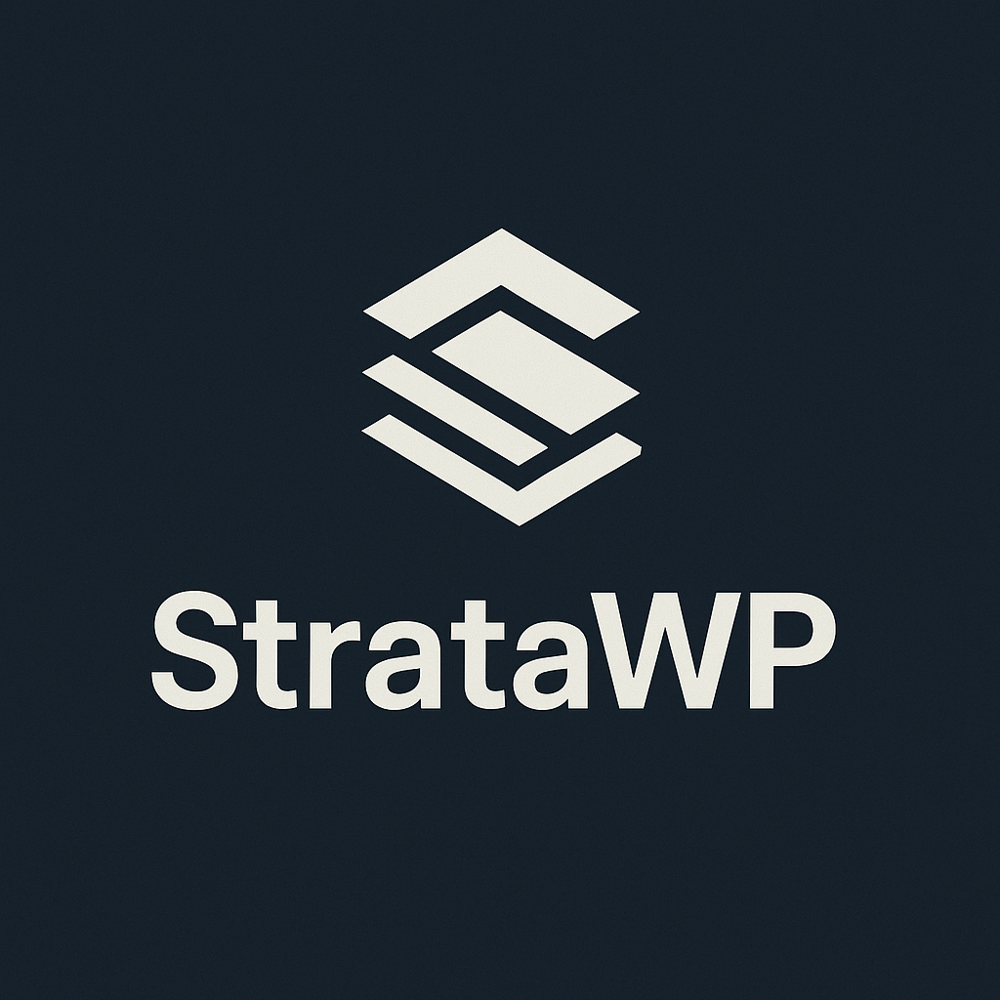

<div align="center">
  

  # StrataWP

  **A modern, powerful WordPress theme framework**
</div>

<div align="center">

[](https://www.gnu.org/licenses/gpl-3.0)
[](https://www.typescriptlang.org/)
[](https://www.php.net/)
[](https://www.npmjs.com/package/@stratawp/cli)
[](https://www.npmjs.com/package/@stratawp/vite-plugin)

</div>

---

StrataWP is a next-generation WordPress theme framework that takes modern development practices to the next level. Built from the ground up with TypeScript, Vite, and cutting-edge tooling, it's designed to make WordPress theme development fast, type-safe, and enjoyable.

## Quick Start

Create a new theme in seconds:

```bash
npx create-stratawp my-theme
cd my-theme
pnpm dev
```

The CLI automatically:
- Guides you through theme setup (name, template, CSS framework)
- Detects your WordPress installation (Local by Flywheel, MAMP)
- Links your theme automatically
- Sets up hot-reload development

**That's it!** Open your WordPress site and activate the theme.

### Documentation

| Document | Description |
|----------|-------------|
| **[Getting Started Guide](./GETTING_STARTED.md)** | Step-by-step tutorial for beginners |
| **[Cheat Sheet](./CHEAT_SHEET.md)** | Quick reference for all commands |
| **[Changelog](./CHANGELOG.md)** | Version history and release notes |

## Why StrataWP?

- **TypeScript-First**: Full type safety across PHP and JavaScript
- **Vite-Powered**: Lightning-fast HMR and sub-second rebuilds
- **Block Theme (FSE)**: Full Site Editing support out of the box
- **Block Auto-Registration**: Automatically discovers and registers Gutenberg blocks
- **PHP Hot Reload**: See PHP template changes without page refresh
- **Three Example Themes**: Production-ready themes to start from
- **CLI Scaffolding**: Generate templates, parts, components, and blocks
- **Design Systems**: Tailwind CSS or UnoCSS with WordPress preset mappings
- **AI-Assisted Dev**: OpenAI GPT-4 and Anthropic Claude integration
- **Component Registry**: npm-powered registry for sharing components
- **Comprehensive Testing**: Vitest unit tests, Playwright E2E
- **Component Explorer**: Interactive Storybook-like component browser
- **Headless WordPress**: REST API client, React hooks, Next.js integration
- **Production Deployment**: SFTP/FTP deployment with change detection
- **Environment Sync**: Database sync between local and production
- **Rollback Support**: Automatic snapshots before deployment

## Project Structure

```
StrataWP/
├── packages/
│   ├── ai/               # AI-assisted development (OpenAI, Anthropic)
│   ├── cli/              # CLI tool (create-stratawp, stratawp commands)
│   ├── core/             # PHP framework core
│   ├── explorer/         # Interactive component browser
│   ├── headless/         # REST API client, React hooks, Next.js
│   ├── registry/         # Component registry
│   ├── sync/             # Environment sync, snapshots, rollback
│   ├── testing/          # Vitest and Playwright utilities
│   └── vite-plugin/      # Vite integration for WordPress
├── examples/
│   ├── basic-theme/      # General purpose starter theme
│   ├── advanced-theme/   # Enterprise theme with CPTs
│   └── store-theme/      # WooCommerce e-commerce theme
└── docs/                 # Documentation
```

## Example Themes

### Basic Theme
General purpose theme for blogs, portfolios, and business sites.
- Frost design system with 52+ patterns
- Custom typography with Google Fonts
- 9 templates including home, blog, archive
- Light and dark mode variants

### Advanced Theme
Enterprise features for complex sites.
- 4 Custom Post Types (Portfolio, Team, Testimonials, Case Studies)
- Custom Gutenberg blocks (Portfolio Grid, Team Members)
- Advanced Layouts component with Customizer
- Complete Meta Boxes system

### Store Theme
Full-featured WooCommerce theme.
- 4 WooCommerce templates (shop, product, cart, checkout)
- Featured Products & Product Categories blocks
- 4 e-commerce patterns
- Mobile-optimized shopping experience

## CLI Commands

```bash
# Create a new theme
npx create-stratawp my-theme

# Generate components
stratawp block:new hero --styleFramework=tailwind
stratawp component:new Analytics --type=feature
stratawp template:new about --type=page
stratawp part:new sidebar --type=sidebar

# Design system
stratawp design-system:setup tailwind

# AI-assisted development
stratawp ai:setup
stratawp ai:generate block
stratawp ai:review functions.php --focus security

# Component registry
stratawp registry:search hero
stratawp registry:install @stratawp/hero-block

# Deployment
stratawp deploy:setup
stratawp deploy production
stratawp deploy production --dry-run

# Database sync
stratawp sync:db:pull production
stratawp sync:db:push staging

# Rollback
stratawp rollback:list
stratawp rollback:diff 1 2

# Package updates
stratawp update
stratawp update --check
```

See the **[Cheat Sheet](./CHEAT_SHEET.md)** for the complete command reference.

## Development

This is a monorepo managed with [Turborepo](https://turbo.build/) and [pnpm](https://pnpm.io/).

```bash
# Install dependencies
pnpm install

# Run all packages in dev mode
pnpm dev

# Build all packages
pnpm build

# Run tests
pnpm test

# Lint and format
pnpm lint
pnpm format
```

### Working with Example Themes

```bash
cd examples/basic-theme
pnpm dev

# Visit your WordPress site - HMR is active!
```

### Updating the CLI

If you've pulled changes and new commands aren't available:

```bash
cd packages/cli
pnpm build
npm install -g .
stratawp --help
```

## Contributing

StrataWP is open-source and contributions are welcome!

- Check out the [CONTRIBUTING.md](./CONTRIBUTING.md) guide
- Report bugs via [GitHub Issues](https://github.com/JonImmsWordpressDev/StrataWP/issues)
- Submit pull requests for new features or fixes

## License

GPL-3.0-or-later - just like WordPress itself.

## Acknowledgments

Inspired by:
- [WPRig](https://wprig.io/) - For the excellent component architecture
- [Next.js](https://nextjs.org/) - For modern DX patterns
- [Vite](https://vitejs.dev/) - For the incredible build tool

## Published Packages

- [@stratawp/cli](https://www.npmjs.com/package/@stratawp/cli) - CLI tool
- [@stratawp/vite-plugin](https://www.npmjs.com/package/@stratawp/vite-plugin) - Vite plugin
- [@stratawp/ai](https://www.npmjs.com/package/@stratawp/ai) - AI tools
- [@stratawp/registry](https://www.npmjs.com/package/@stratawp/registry) - Component registry
- [@stratawp/sync](https://www.npmjs.com/package/@stratawp/sync) - Environment sync
- [@stratawp/testing](https://www.npmjs.com/package/@stratawp/testing) - Testing utilities
- [@stratawp/headless](https://www.npmjs.com/package/@stratawp/headless) - Headless WordPress
- [@stratawp/explorer](https://www.npmjs.com/package/@stratawp/explorer) - Component explorer

---

**Current Version**: v1.3.0 - See [CHANGELOG.md](./CHANGELOG.md) for details.

Built with ❤️ by [Jon Imms](https://jonimms.com)
