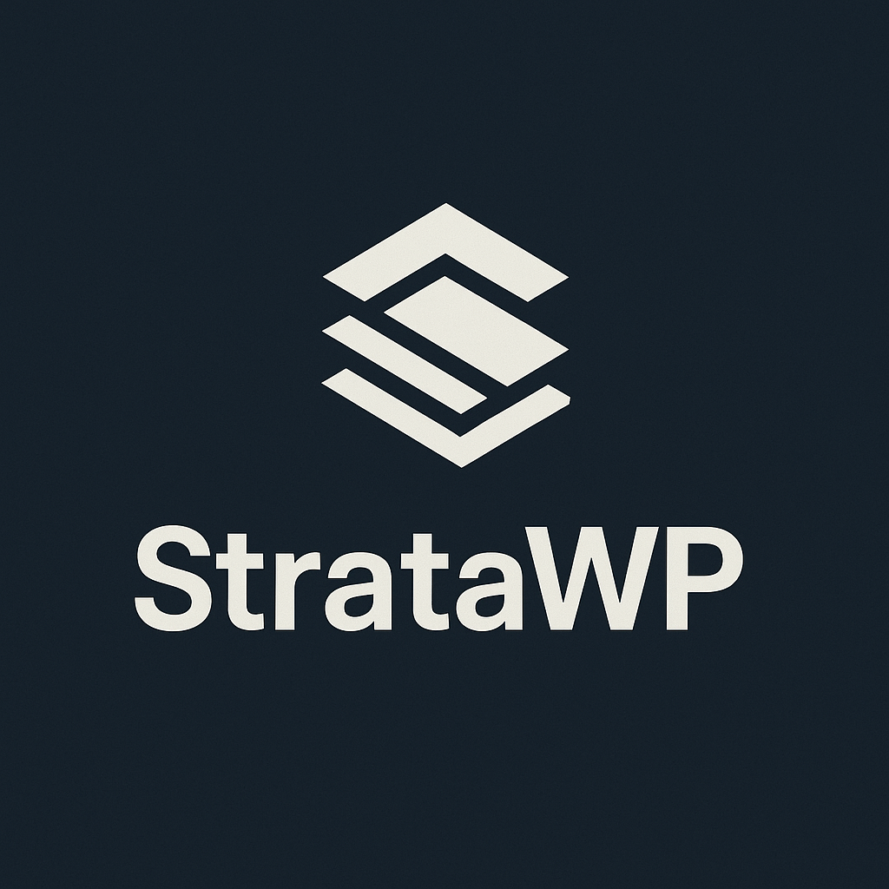

<div align="center">
  

# StrataWP

**A modern, powerful WordPress theme framework**

</div>

<div align="center">

[](https://www.gnu.org/licenses/gpl-3.0)
[](https://www.typescriptlang.org/)
[](https://www.php.net/)
[](https://www.npmjs.com/package/@stratawp/cli)
[](https://www.npmjs.com/package/@stratawp/vite-plugin)

</div>

---

StrataWP is a next-generation WordPress theme framework that takes modern development practices to the next level. Built from the ground up with TypeScript, Vite, and cutting-edge tooling, it's designed to make WordPress **Block Theme (FSE)** development fast, type-safe, and enjoyable.

Scaffold a full theme with one command, edit PHP/SCSS/TypeScript and see changes hot-reload instantly, generate blocks and templates from the CLI, then deploy to production with automatic snapshots and rollback.

> **New here?** Jump to [Quick Start (5 minutes)](#quick-start-5-minutes) and copy-paste your way to a running theme.

## Why StrataWP?

- **TypeScript-First** — full type safety across PHP and JavaScript.
- **Vite-Powered** — fast HMR and sub-second rebuilds.
- **Block Theme (FSE)** — Full Site Editing support out of the box.
- **Block Auto-Registration** — automatically discovers and registers Gutenberg blocks.
- **PHP Hot Reload** — see PHP template changes without a manual page refresh.
- **Three Example Themes** — Basic, Advanced, and Store starters to learn from or build on.
- **CLI Scaffolding** — generate blocks, components, templates, and parts.
- **Design Systems** — Tailwind CSS or UnoCSS with WordPress preset mappings.
- **Comprehensive Testing** — Vitest unit tests and Playwright E2E.
- **Quality Gates** — a shared Stylelint preset, axe accessibility checks, cross-browser smoke tests (Chromium, Firefox, WebKit), and Lighthouse budgets in CI.
- **Theme Review** — `pnpm review` checks a theme against an approximation of the WordPress.org theme guidelines and detects block, classic, or hybrid themes.
- **Screenshots & Visual Checks** — capture screenshots of a running theme from the CLI or an AI agent, plus an opt-in visual compare gate.
- **Component Explorer** — an interactive, Storybook-style component browser.
- **Headless WordPress** — typed REST API client, React hooks, and Next.js integration.
- **Production Deployment** — SFTP/FTP/SSH deployment with change detection.
- **Environment Sync & Rollback** — database sync plus automatic pre-deploy snapshots.
- **AI-Assisted Development** — a built-in agent protocol (`AGENTS.md` + `.ai/`), agent skills, one-command agent setup, and a docs MCP server.

## Prerequisites

Make sure the following are installed before you begin.

| Requirement                       | Version         | Notes                                                                                   |
| --------------------------------- | --------------- | --------------------------------------------------------------------------------------- |
| **Node.js**                       | 18.18 or higher | `engines` requires `node >=18.18`.                                                      |
| **pnpm**                          | 8 or higher     | Recommended package manager (`npm` also works).                                         |
| **PHP**                           | 8.1 or higher   |                                                                                         |
| **WordPress**                     | 6.7 or higher   | What StrataWP is developed against.                                                     |
| **A local WordPress environment** | —               | [Local by Flywheel](https://localwp.com/), [MAMP](https://www.mamp.info/), Docker, etc. |

Install pnpm if you don't have it:

```bash
npm install -g pnpm
```

> **Note:** The generated themes' `style.css` headers declare `Requires at least: 6.7` and `Tested up to: 7.1`. Adjust `Tested up to` to the WordPress version you have actually tested against.

> **Tip:** For the best experience, use VS Code with the ESLint, Prettier, PHP Intelephense, and TypeScript/JavaScript language extensions.

## Quick Start (5 minutes)

New to all this? Follow these steps in order, copy-pasting each command. Every step tells you what you should see when it worked.

> **Warning:** Run these commands in a **projects folder** (for example `~/Projects`), **not** inside your WordPress `wp-content/themes/` folder. StrataWP links your theme into WordPress for you.

### Step 1: Check your tools (1 minute)

Open a terminal and run:

```bash
node -v    # should print v18.18 or higher
pnpm -v    # should print 8 or higher
```

- No Node.js? Install the LTS version from [nodejs.org](https://nodejs.org/), then open a new terminal.
- No pnpm? Run `npm install -g pnpm`.
- You also need a local WordPress site running (6.7 or higher). [Local by Flywheel](https://localwp.com/) is the easiest option and includes PHP. [MAMP](https://www.mamp.info/) and Docker work too.

### Step 2: Create your theme

```bash
mkdir -p ~/Projects
cd ~/Projects
npx create-stratawp@latest my-theme
```

A short wizard asks you questions. If you are unsure, the first (recommended) answer is a good default:

| Question                         | What it means                                                                                                                                                                                  |
| -------------------------------- | ---------------------------------------------------------------------------------------------------------------------------------------------------------------------------------------------- |
| Theme name, description, author  | Shown in WordPress under Appearance → Themes.                                                                                                                                                  |
| Template                         | **Basic** is the best starting point. Advanced adds extra layouts and works with a companion plugin for portfolio, team, testimonial and case-study content. Store adds WooCommerce templates. |
| CSS framework                    | How you write styles: plain CSS, Tailwind, UnoCSS, or Panda. UnoCSS is recommended.                                                                                                            |
| TypeScript / testing             | Say yes to both if you are not sure.                                                                                                                                                           |
| Link to a WordPress installation | Pick your local site. StrataWP creates the link into `wp-content/themes/` so you never copy files around.                                                                                      |
| Companion plugin (Advanced only) | After linking, you are asked whether to copy the `strata-advanced-content` plugin into that site's `wp-content/plugins/`. Say yes, then activate it under Plugins.                             |

It installs the dependencies for you (`pnpm install` runs automatically). When it finishes you will see the next-step commands.

> **Note:** If no WordPress install was detected, link the theme yourself:
>
> ```bash
> ln -s "$(pwd)/my-theme" /path/to/wordpress/wp-content/themes/my-theme
> ```

### Step 3: Start the dev server

```bash
cd my-theme
pnpm dev
```

You should see Vite start on **http://localhost:3000**. Leave this terminal open: it must keep running for live reload.

> **"Port 3000 is already in use"?** Run `pnpm dev --port 3001` instead.

### Step 4: Activate the theme in WordPress

1. Open your local WordPress admin (for example `http://my-site.local/wp-admin`).
2. Go to **Appearance → Themes**.
3. Find your theme and click **Activate**.
4. Visit the site. You are now looking at your StrataWP theme.

### Step 5: Make your first change

Edit any file in `src/scss/` or `templates/`, save it, and watch the browser update by itself. That is the whole development loop.

### Step 6: Build for production

When you are happy with the result:

```bash
pnpm build
```

This writes the optimized files to `dist/`. The files WordPress needs in production are `dist/`, the PHP files, `theme.json`, `style.css` and `vendor/`.

## Using StrataWP day to day

Everything below runs inside your theme folder (`my-theme/`).

### Install the `stratawp` command (optional, recommended)

The generators and deployment tools live in the CLI. Install it once:

```bash
npm install -g @stratawp/cli
stratawp --help
```

### Add things to your theme

```bash
stratawp block:new hero          # a Gutenberg block
stratawp component:new Analytics # a PHP feature component
stratawp template:new about      # a Full Site Editing template
stratawp part:new sidebar        # a template part
```

Each command creates the files in the right folders and, for blocks, registers them automatically. Re-run `pnpm dev` if it was stopped.

### Check your theme before you ship it

| Command         | What it checks                                                                                            |
| --------------- | --------------------------------------------------------------------------------------------------------- |
| `pnpm review`   | A theme review that approximates the WordPress.org theme guidelines. Errors fail it; warnings are advice. |
| `pnpm lint:css` | Stylelint rules for nesting depth, specificity and custom-property names.                                 |
| `pnpm ai:check` | Builds the theme and runs the review, the same gate AI agents use.                                        |
| `pnpm test:e2e` | Cross-browser smoke tests against your running site (see the commands below).                             |

`pnpm review` is a helper, not a certification: passing it does not guarantee that WordPress.org accepts your theme.

Every StrataWP theme (the three examples and the three templates) currently reports **0 errors and 0 warnings** in the review, and `pnpm review` in this repository is expected to stay that way. A theme you generate starts clean too: it ships a 1200x900 `screenshot.png` (the size WordPress.org expects) and a `readme.txt` whose short description matches `style.css`. `create-stratawp` updates the name, description and author in `style.css` and `readme.txt`; replace `screenshot.png` with your own 1200x900 image.

To run the smoke tests against your local site, install the test browser once, then point the tests at your site's address:

```bash
pnpm exec playwright install chromium
WP_BASE_URL=http://my-site.local pnpm test:e2e
```

### Advanced template: the companion plugin

The Advanced theme does not register content types itself, because the WordPress.org guidelines reserve `register_post_type` and `register_taxonomy` for plugins. Its portfolio, team, testimonial and case-study types live in the `strata-advanced-content` plugin. `create-stratawp` offers to copy it into your linked site; the theme works without it, those content types are just absent. To install it by hand, copy the folder into `wp-content/plugins/` and activate it: from this repository it is `plugins/strata-advanced-content`, and for `npx` users it is `templates/plugins/strata-advanced-content` inside the installed `@stratawp/cli` package (the installer prints the exact path).

### Take screenshots of your theme

With your site running, capture the home page and a 404 page at desktop and phone widths:

```bash
pnpm exec playwright install chromium     # once
pnpm exec stratawp-screenshots capture --base-url=http://my-site.local
```

The images land in `.stratawp/screenshots/` (add that folder to your `.gitignore`). Use `--routes=/,/blog` and `--widths=1280,390` to choose what to capture. The same thing is available as `stratawp screenshots`.

Want a pass/fail visual check? `pnpm test:visual` compares pages against saved baseline images. It is opt-in and the baselines must be recorded first. See [AI tooling and visual checks](./docs/ai-tooling.md#screenshots-and-visual-checks) for the full steps.

### Deploy

```bash
stratawp deploy:setup               # one-time questions (host, credentials)
stratawp deploy production --dry-run   # preview what would change
stratawp deploy production          # ship it (a snapshot is taken first)
```

If something goes wrong, `stratawp rollback:list` shows your snapshots. See the [Deployment guide](./docs/deployment/getting-started.md).

### If something goes wrong

| Problem                                        | Fix                                                                                           |
| ---------------------------------------------- | --------------------------------------------------------------------------------------------- |
| `stratawp: command not found`                  | Run `npm install -g @stratawp/cli`, then open a new terminal.                                 |
| Theme missing in Appearance → Themes           | The link was not created. Use the `ln -s` command from Step 2.                                |
| Page does not update when you edit             | Make sure `pnpm dev` is still running in a terminal.                                          |
| `pnpm review` reports errors                   | Read the message: each one names the file and the rule. Fix the error and run it again.       |
| Screenshots or smoke tests say "not reachable" | Your site is not running at that address. Start it, or pass `--base-url` / set `WP_BASE_URL`. |
| "Could not start Chromium"                     | Run `pnpm exec playwright install chromium`.                                                  |

More help: the [FAQ & Troubleshooting](https://github.com/JonImmsWordpressDev/strataWP/wiki/FAQ-and-Troubleshooting) wiki page and the full **[Getting Started Guide](./GETTING_STARTED.md)**.

## What you can do

Each capability links to its in-repo guide and matching wiki page.

| Task                           | Command(s)                                                                      | Learn more                                                                                                                   |
| ------------------------------ | ------------------------------------------------------------------------------- | ---------------------------------------------------------------------------------------------------------------------------- |
| **Run the dev loop (HMR)**     | `pnpm dev`                                                                      | [Core Concepts](https://github.com/JonImmsWordpressDev/strataWP/wiki/Core-Concepts)                                          |
| **Build for production**       | `pnpm build`                                                                    | [Deployment](https://github.com/JonImmsWordpressDev/strataWP/wiki/Deployment)                                                |
| **Generate a Gutenberg block** | `stratawp block:new <name>`                                                     | [Blocks, Patterns & Design Systems](https://github.com/JonImmsWordpressDev/strataWP/wiki/Blocks-Patterns-and-Design-Systems) |
| **Generate a PHP component**   | `stratawp component:new <name>`                                                 | [Core Concepts](https://github.com/JonImmsWordpressDev/strataWP/wiki/Core-Concepts)                                          |
| **Generate an FSE template**   | `stratawp template:new <name>`                                                  | [Blocks, Patterns & Design Systems](https://github.com/JonImmsWordpressDev/strataWP/wiki/Blocks-Patterns-and-Design-Systems) |
| **Generate a template part**   | `stratawp part:new <name>`                                                      | [Blocks, Patterns & Design Systems](https://github.com/JonImmsWordpressDev/strataWP/wiki/Blocks-Patterns-and-Design-Systems) |
| **Set up a design system**     | `stratawp design-system:setup tailwind`                                         | [Blocks, Patterns & Design Systems](https://github.com/JonImmsWordpressDev/strataWP/wiki/Blocks-Patterns-and-Design-Systems) |
| **Browse components visually** | `stratawp explorer`                                                             | [Architecture & Packages](https://github.com/JonImmsWordpressDev/strataWP/wiki/Architecture-and-Packages)                    |
| **Run tests**                  | `pnpm test` · `pnpm test:e2e`                                                   | [Testing & Quality](https://github.com/JonImmsWordpressDev/strataWP/wiki/Testing-and-Quality)                                |
| **Review a theme**             | `pnpm review` · `stratawp theme:review`                                         | [AI tooling](./docs/ai-tooling.md)                                                                                           |
| **Capture screenshots**        | `stratawp screenshots` · `pnpm exec stratawp-screenshots capture`               | [AI tooling](./docs/ai-tooling.md#screenshots-and-visual-checks)                                                             |
| **Visual compare (opt-in)**    | `pnpm test:visual`                                                              | [AI tooling](./docs/ai-tooling.md#screenshots-and-visual-checks)                                                             |
| **Build a headless front-end** | `pnpm add @stratawp/headless`                                                   | [Headless WordPress](https://github.com/JonImmsWordpressDev/strataWP/wiki/Headless-WordPress)                                |
| **Deploy to a server**         | `stratawp deploy:setup` · `stratawp deploy production`                          | [Deployment](https://github.com/JonImmsWordpressDev/strataWP/wiki/Deployment)                                                |
| **Sync databases & templates** | `stratawp sync:db:pull production` · `stratawp sync:templates production --all` | [Environment Sync & Rollback](https://github.com/JonImmsWordpressDev/strataWP/wiki/Environment-Sync-and-Rollback)            |
| **Roll back a deployment**     | `stratawp rollback:list` · `stratawp rollback:diff 1 2`                         | [Environment Sync & Rollback](https://github.com/JonImmsWordpressDev/strataWP/wiki/Environment-Sync-and-Rollback)            |
| **Update the CLI & packages**  | `stratawp update`                                                               | [CLI Reference](https://github.com/JonImmsWordpressDev/strataWP/wiki/CLI-Reference)                                          |

> **Tip:** The **[Cheat Sheet](./CHEAT_SHEET.md)** lists every command and flag in one place.

### A taste of the CLI

```bash
# Generate components
stratawp block:new hero --styleFramework=tailwind
stratawp component:new Analytics --type=feature
stratawp template:new about --type=page
stratawp part:new sidebar --type=sidebar

# Set up a design system
stratawp design-system:setup tailwind

# Deploy
stratawp deploy:setup
stratawp deploy production --dry-run
stratawp deploy production

# Sync and roll back
stratawp sync:templates production --all
stratawp sync:db:pull production
stratawp rollback:list
```

## Project Structure

StrataWP is a monorepo managed with [Turborepo](https://turbo.build/) and [pnpm](https://pnpm.io/) workspaces.

```
StrataWP/
├── packages/
│   ├── cli/              # CLI tool (create-stratawp + stratawp commands)
│   ├── create-stratawp/  # One-command scaffolding wrapper
│   ├── core/             # PHP framework core (Components, hooks, template tags)
│   ├── vite-plugin/      # Vite integration: HMR, block auto-discovery, manifest
│   ├── explorer/         # Interactive component browser
│   ├── headless/         # REST API client, React hooks, Next.js integration
│   ├── sync/             # Environment sync, snapshots, rollback
│   ├── testing/          # Vitest and Playwright utilities, screenshots, visual compare
│   ├── theme-review/     # Theme checker (WordPress.org guidelines, approximate)
│   ├── stylelint-config/ # Shared Stylelint preset
│   └── mcp/              # MCP server exposing generators to AI agents
├── examples/
│   ├── basic-theme/      # General-purpose starter theme
│   ├── advanced-theme/   # Advanced layouts and custom blocks (content types come from a companion plugin)
│   └── store-theme/      # WooCommerce e-commerce theme
└── docs/                 # Documentation
```

A generated theme has this layout:

```
my-theme/
├── inc/Components/   # PHP components (theme features)
├── patterns/         # Block patterns (*.php)
├── parts/            # Template parts (*.html)
├── src/
│   ├── blocks/       # Gutenberg blocks (block.json, index.tsx, save.tsx)
│   ├── scss/         # Styles
│   └── main.ts       # Entry point
├── templates/        # FSE templates (*.html)
├── functions.php     # Theme entry point
├── readme.txt        # WordPress.org-style readme (name and description updated by the scaffolder)
├── screenshot.png    # 1200x900 theme screenshot
├── style.css         # Theme metadata
├── theme.json        # FSE configuration
└── vite.config.ts    # Build configuration
```

See [Project Structure](https://github.com/JonImmsWordpressDev/strataWP/wiki/Project-Structure) for a full map.

## Example Themes

| Theme                                     | Best for                                             | Highlights                                                                                                                                                                                                                    |
| ----------------------------------------- | ---------------------------------------------------- | ----------------------------------------------------------------------------------------------------------------------------------------------------------------------------------------------------------------------------- |
| **[Basic](./examples/basic-theme)**       | Blogs, portfolios, business sites, learning StrataWP | [Frost](https://frostwp.com/) design system, 50 block patterns, 9 templates, light/dark variants, Google Fonts typography                                                                                                     |
| **[Advanced](./examples/advanced-theme)** | Complex / production sites and agencies              | Custom blocks, Advanced Layouts + Customizer, Meta Boxes system; works with the [`strata-advanced-content`](./plugins/strata-advanced-content) companion plugin for Portfolio, Team, Testimonial and Case Study content types |
| **[Store](./examples/store-theme)**       | WooCommerce e-commerce                               | WooCommerce templates (shop, product, cart, checkout), Featured Products & Product Categories blocks, e-commerce patterns, mobile-optimized                                                                                   |

Learn how to run and customize them on the [Example Themes](https://github.com/JonImmsWordpressDev/strataWP/wiki/Example-Themes) wiki page.

## Documentation

### Wiki (guides & reference)

| Page                                                                                                                         | What it covers                                |
| ---------------------------------------------------------------------------------------------------------------------------- | --------------------------------------------- |
| [Home](https://github.com/JonImmsWordpressDev/strataWP/wiki/Home)                                                            | Wiki landing page and index                   |
| [Installation & Quick Start](https://github.com/JonImmsWordpressDev/strataWP/wiki/Installation-and-Quick-Start)              | Set up and create your first theme            |
| [Core Concepts](https://github.com/JonImmsWordpressDev/strataWP/wiki/Core-Concepts)                                          | Components, hooks, HMR, and the PHP framework |
| [Project Structure](https://github.com/JonImmsWordpressDev/strataWP/wiki/Project-Structure)                                  | Monorepo and theme layout                     |
| [CLI Reference](https://github.com/JonImmsWordpressDev/strataWP/wiki/CLI-Reference)                                          | Every command and flag                        |
| [Blocks, Patterns & Design Systems](https://github.com/JonImmsWordpressDev/strataWP/wiki/Blocks-Patterns-and-Design-Systems) | Scaffolding and styling                       |
| [Example Themes](https://github.com/JonImmsWordpressDev/strataWP/wiki/Example-Themes)                                        | Basic, Advanced, and Store walkthroughs       |
| [Headless WordPress](https://github.com/JonImmsWordpressDev/strataWP/wiki/Headless-WordPress)                                | REST client, React hooks, Next.js             |
| [Testing & Quality](https://github.com/JonImmsWordpressDev/strataWP/wiki/Testing-and-Quality)                                | Vitest, Playwright, custom matchers           |
| [Deployment](https://github.com/JonImmsWordpressDev/strataWP/wiki/Deployment)                                                | SFTP/FTP/SSH deployment                       |
| [Environment Sync & Rollback](https://github.com/JonImmsWordpressDev/strataWP/wiki/Environment-Sync-and-Rollback)            | DB sync, snapshots, rollback                  |
| [Architecture & Packages](https://github.com/JonImmsWordpressDev/strataWP/wiki/Architecture-and-Packages)                    | How the packages fit together                 |
| [AI, Agent Skills & MCP](https://github.com/JonImmsWordpressDev/strataWP/wiki/AI-Agent-Skills-and-MCP)                       | Agent skills and the MCP server               |
| [Contributing & Releases](https://github.com/JonImmsWordpressDev/strataWP/wiki/Contributing-and-Releases)                    | Contributing workflow and releases            |
| [FAQ & Troubleshooting](https://github.com/JonImmsWordpressDev/strataWP/wiki/FAQ-and-Troubleshooting)                        | Common issues and fixes                       |

### In-repo guides

| Document                                                        | Description                                    |
| --------------------------------------------------------------- | ---------------------------------------------- |
| [Getting Started Guide](./GETTING_STARTED.md)                   | Step-by-step tutorial for beginners            |
| [Cheat Sheet](./CHEAT_SHEET.md)                                 | Quick reference for all commands               |
| [Deployment Guide](./docs/deployment/getting-started.md)        | Basic deployment with SFTP/FTP/SSH             |
| [Advanced Deployment](./docs/deployment/ADVANCED-DEPLOYMENT.md) | SSH keys, FSE template sync, plugin deployment |
| [Roadmap](./ROADMAP.md)                                         | Where StrataWP is heading                      |
| [Changelog](./CHANGELOG.md)                                     | Version history and release notes              |

## Development

Working on StrataWP itself (or running it from a clone)? Use the root scripts:

```bash
# Install all dependencies
pnpm install

# Run all packages in dev mode
pnpm dev

# Build all packages
pnpm build

# Run tests
pnpm test

# Lint and format
pnpm lint
pnpm format
```

### Run an example theme

```bash
cd examples/basic-theme
pnpm dev
# Visit your WordPress site — HMR is active.
```

### Update the CLI after pulling changes

If you've pulled new commits and a new command isn't showing up, rebuild and reinstall the globally linked CLI:

```bash
cd packages/cli
pnpm build
npm install -g .
stratawp --help
```

## AI-Assisted Development

StrataWP is built to be developed _with_ AI coding agents, not just _by_ them. The repository ships a structured, agent-agnostic workflow so Claude Code, Cursor, GitHub Copilot, Gemini CLI, Codex, and Windsurf all follow the same rules — and produce code that actually fits the framework.

**New to AI-assisted coding?** Follow the quick start below. You don't need to understand any of the machinery first — the whole point is that your AI tool reads these files itself and learns how StrataWP works.

### What's included

| File / Directory              | What it does                                                                                                                    |
| ----------------------------- | ------------------------------------------------------------------------------------------------------------------------------- |
| [`AGENTS.md`](./AGENTS.md)    | The rulebook every agent reads first: onboarding, build-pipeline rules, contract-first specs, and a pre-flight quality gate     |
| `.ai/ONBOARDING.md`           | Step-by-step onboarding an agent follows on its first session                                                                   |
| `.ai/PROJECT_RULES.md`        | The agent's long-term memory — conventions and decisions it records so future sessions don't repeat mistakes                    |
| `.ai/developer-directions.md` | **Your** standing instructions to every agent (design rules, priorities, do-not-touch areas)                                    |
| `.ai/skills/`                 | Step-by-step recipes for StrataWP tasks: architecture, planning, components, blocks, testing, deployment, releases, self-review |
| `.ai/plans/`                  | Feature specs the agent writes and you approve before it codes                                                                  |
| `.claude/skills/`             | Deep WordPress domain skills (blocks, theme.json, REST API, WP-CLI, performance, PHPStan)                                       |
| `.aiignore`                   | Keeps agents out of build artifacts and vendored snapshots                                                                      |

### Quick start: your first AI session

**Step 1 — Pick your AI tool and configure it (one time).**

Claude Code and Codex work out of the box (they read `CLAUDE.md` / `AGENTS.md` automatically). For Cursor, GitHub Copilot, Gemini CLI, or Windsurf, run:

```bash
pnpm ai:setup
```

Select your tool from the list. This writes a small instruction file your tool reads automatically — you never need to paste rules into a chat window.

**Step 2 — Open the repo in your AI tool and let it onboard.**

Start your agent in the repository root and say:

> Read AGENTS.md and complete your onboarding.

The agent reads the protocol, checks its state file, reads your directions, maps the codebase, and records that it's onboarded. This happens once — later sessions skip straight to work.

**Step 3 — Ask for what you want, in plain English.**

Examples of good first prompts:

> Create a "testimonial" block for the basic-theme example, with a quote, author name, and photo.

> Add a PHP component that outputs Open Graph meta tags, and register it in the basic theme.

For anything non-trivial, the agent won't jump straight to code — it will ask clarifying questions, write a short spec in `.ai/plans/`, and wait for your approval. That's intentional (it's the contract-first rule in `AGENTS.md`): you approve the plan, then it builds.

**Step 4 — Verify the work before you accept it.**

Ask the agent to run the quality gate, or run it yourself:

```bash
pnpm ai:check    # lint + format + typecheck + unit tests, all must pass
```

If the change affects what visitors see, also run the accessibility suite (`pnpm test:e2e` — requires wp-env, see [Testing & Quality](https://github.com/JonImmsWordpressDev/strataWP/wiki/Testing-and-Quality)).

**Step 5 — Teach it your preferences (optional but powerful).**

Open [`.ai/developer-directions.md`](./.ai/developer-directions.md) and fill in your brand colors, coding preferences, and do-not-touch areas. Every agent reads this file on every project — write an instruction once and never repeat it in chat again. The agent also keeps its own notes in `.ai/PROJECT_RULES.md`; skim it occasionally to see what it has learned.

### Give your agent StrataWP superpowers (MCP)

[MCP (Model Context Protocol)](https://modelcontextprotocol.io/) lets AI tools call live capabilities instead of guessing. StrataWP ships two servers:

- **Docs server** (`pnpm mcp:docs`) — dependency-free search over this repo's documentation (`stratawp_docs_search`, `stratawp_docs_read`).
- **`@stratawp/mcp` package** — exposes the framework's generators and component catalog as tools/resources, plus read-only `review_theme`, `detect_theme_type` and `capture_screenshots` tools (see [AI tooling](./docs/ai-tooling.md)).

To register the docs server, add this to your tool's MCP config (e.g. `.mcp.json` for Claude Code, `.cursor/mcp.json` for Cursor):

```json
{
  "mcpServers": {
    "stratawp-docs": {
      "command": "node",
      "args": ["scripts/mcp-docs-server.mjs"]
    }
  }
}
```

Then ask your agent things like _"search the StrataWP docs for conditional styles"_ and it will pull the real documentation instead of hallucinating an answer.

### Tips for beginners

- **Small asks beat big asks.** "Add a hero block" works better than "redesign my theme".
- **Let the agent use the scaffolders.** The rules already tell it to prefer `stratawp block:new` / `component:new` over hand-written boilerplate — that's how output stays consistent.
- **Never merge unverified work.** If the agent says it's done but `pnpm ai:check` wasn't run, run it.
- **Agents follow the same rules as humans here:** source files only, pnpm only, specs before big changes. If a suggestion violates those, the agent is off-protocol — tell it to re-read `AGENTS.md`.

## Contributing

StrataWP is open source and contributions are welcome.

- Read the **[CONTRIBUTING.md](./CONTRIBUTING.md)** guide.
- Report bugs via [GitHub Issues](https://github.com/JonImmsWordpressDev/StrataWP/issues).
- Ask questions in [GitHub Discussions](https://github.com/JonImmsWordpressDev/StrataWP/discussions).
- Submit pull requests for new features or fixes.

See [Contributing & Releases](https://github.com/JonImmsWordpressDev/strataWP/wiki/Contributing-and-Releases) for the full workflow, and the [Roadmap](./ROADMAP.md) for what's planned next.

## License

GPL-3.0-or-later — just like WordPress itself.

## Acknowledgments

Inspired by and built on:

- [Frost](https://frostwp.com/) by WP Engine (GPL) — the block design system the example themes build on.
- A prior-art GPL WordPress starter theme — for the component architecture.
- [Next.js](https://nextjs.org/) — for modern DX patterns.
- [Vite](https://vitejs.dev/) — for the build tooling.

## Published Packages

| Package                                                                                | Description                                                              |
| -------------------------------------------------------------------------------------- | ------------------------------------------------------------------------ |
| [create-stratawp](https://www.npmjs.com/package/create-stratawp)                       | One-command scaffolder — what `npx create-stratawp` runs                 |
| [@stratawp/cli](https://www.npmjs.com/package/@stratawp/cli)                           | CLI tool (provides the `stratawp` command and bundles `create-stratawp`) |
| [@stratawp/vite-plugin](https://www.npmjs.com/package/@stratawp/vite-plugin)           | Vite plugin for WordPress                                                |
| [@stratawp/sync](https://www.npmjs.com/package/@stratawp/sync)                         | Environment sync, snapshots, rollback                                    |
| [@stratawp/testing](https://www.npmjs.com/package/@stratawp/testing)                   | Testing utilities (Vitest, Playwright), screenshots, visual compare      |
| [@stratawp/theme-review](https://www.npmjs.com/package/@stratawp/theme-review)         | Theme checker approximating the WordPress.org guidelines                 |
| [@stratawp/stylelint-config](https://www.npmjs.com/package/@stratawp/stylelint-config) | Shared Stylelint preset                                                  |
| [@stratawp/headless](https://www.npmjs.com/package/@stratawp/headless)                 | Headless WordPress (REST client, React hooks, Next.js)                   |
| [@stratawp/explorer](https://www.npmjs.com/package/@stratawp/explorer)                 | Component explorer                                                       |

The repository also includes `@stratawp/core` (the PHP framework) and `@stratawp/mcp` (an MCP server that exposes the scaffolding generators to AI agents). See [Architecture & Packages](https://github.com/JonImmsWordpressDev/strataWP/wiki/Architecture-and-Packages) for how everything fits together.

---

See the [Changelog](./CHANGELOG.md) for the version history; the badges at the top show the latest published versions.

Built with ❤️ by [Jon Imms](https://jonimms.com)
